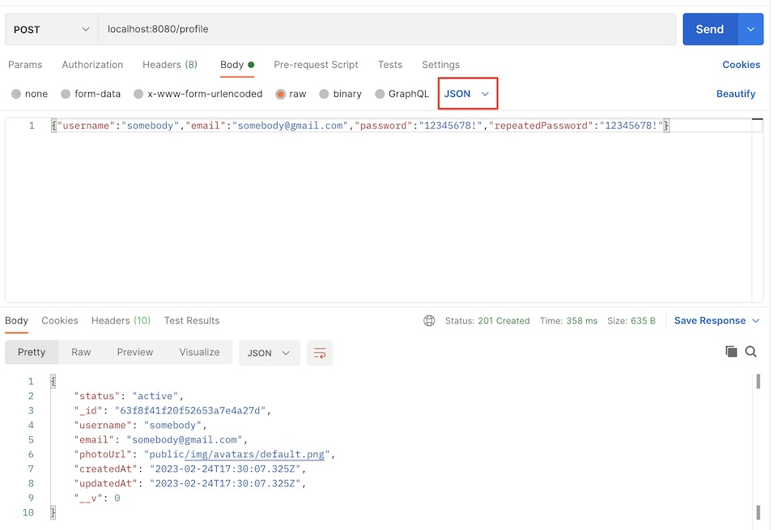

# restaurants-nodejs-mongo

## Installation

```
docker run -p 27017:27017 --name rests -d mongo:5.0.11
```

Copy example.env and rename it

Open Docker Dashboard and make sure that container rests is running.

### Create a user


