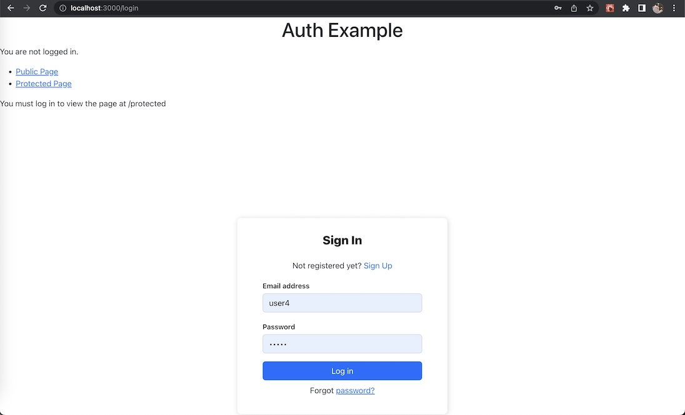

# restaurants-nodejs-

## Description

A monorepo for the blog post about Cypress



## Installation

```
docker run -p 27017:27017 --name rests -d mongo:5.0.11
```

Copy example.env in server folder and rename it

Open Docker Dashboard and make sure that container rests is running.

### Backend

```
cd server
npm i
npm start
```

### Frontend

```
cd client
npm i
npm start
```
